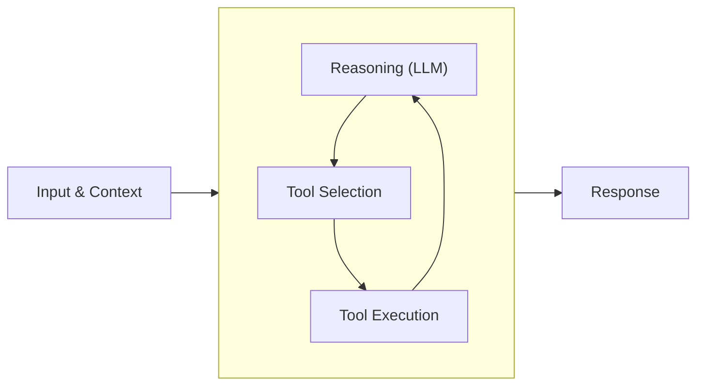

# Agent Loop in Strands

The agent loop is a foundational concept in the Strands Agents SDK that powers intelligent, autonomous agent behavior. It enables agents to process user input, make decisions, execute tools, and generate coherent responses through a cycle of reasoning and action.

## What is the Agent Loop?

The agent loop is the process by which a Strands agent processes input, makes decisions, executes tools, and generates responses. This cycle may repeat multiple times within a single user interaction, allowing the agent to perform complex, multi-step reasoning with autonomous tool use.



The agent loop follows these key steps:

1. **Receives user input** and existing conversation context
2. **Processes input** using a language model (LLM)
3. **Decides** whether to use tools to gather information or perform actions
4. **Executes tools** and incorporates results
5. **Continues reasoning** with new information
6. **Produces a final response** or iterates through the loop again

## Core Components

The agent loop consists of several integrated components:

### Event Loop Cycle

The central mechanism that orchestrates information flow is the event loop cycle, implemented in the `event_loop_cycle` function:

```python
def event_loop_cycle(
    model: Model,
    system_prompt: Optional[str],
    messages: Messages,
    tool_config: Optional[ToolConfig],
    **kwargs: Any,
) -> Tuple[StopReason, Message, EventLoopMetrics, Any]:
    # Implementation details
```

This function:
- Processes messages with the language model
- Handles tool execution requests
- Manages conversation state
- Handles errors with retry mechanisms
- Collects metrics for observability

### Message Processing

Messages flow through the agent loop in a structured format:

1. **User messages**: Input that initiates the loop
2. **Assistant messages**: Responses from the model that may include tool requests
3. **Tool result messages**: Results from tool executions fed back to the model

The SDK automatically formats these messages into the appropriate structure for model inputs and maintains them in the conversation history.

### Tool Execution

The tool execution system:
1. Validates tool requests from the model
2. Looks up tools in the registry
3. Executes tools with proper error handling
4. Captures and formats results
5. Feeds results back to the model for further reasoning

## Detailed Flow

Let's examine the detailed flow of the agent loop:

### 1. Initialization

When an agent is created, it sets up the necessary components:

```python
from strands import Agent
from strands_tools import calculator

# Initialize the agent with tools, model, and configuration
agent = Agent(
    tools=[calculator],
    system_prompt="You are a helpful assistant."
)
```

This initialization:
- Creates a tool registry and registers tools
- Sets up the conversation manager
- Initializes metrics collection

### 2. User Input Processing

When the agent receives a user input:

```python
# Process user input
result = agent("Calculate 25 * 48")
```

The agent:
- Adds the message to conversation history
- Applies conversation management strategies
- Initializes a new event loop cycle

### 3. Model Reasoning

The model receives:
- System prompt (if provided)
- Complete conversation history
- Tool specifications (if available)

The model then generates a response that can include:
- Direct text response to the user
- Tool use requests for performing actions

### 4. Tool Request Processing

If the model decides to use a tool, it generates a request like:

```json
{
  "role": "assistant",
  "content": [
    {
      "toolUse": {
        "toolUseId": "tool_123",
        "name": "calculator",
        "input": {
          "expression": "25 * 48"
        }
      }
    }
  ]
}
```

The event loop:
- Extracts and validates the tool request
- Looks up the tool in the registry
- Executes the tool
- Captures the result

### 5. Tool Result Integration

The tool result is formatted as:

```json
{
  "role": "user",
  "content": [
    {
      "toolResult": {
        "toolUseId": "tool_123",
        "status": "success",
        "content": [
          {"text": "1200"}
        ]
      }
    }
  ]
}
```

This result is:
- Added to the conversation history
- Sent back to the model for further reasoning

### 6. Recursive Processing

The agent loop can recursively continue if:
- The model requests more tool executions
- Multi-step reasoning is required
- Further clarification is needed

This enables complex workflows like:
1. User asks a question about weather trends
2. Agent uses a search tool to find weather data
3. Agent uses a calculator to process temperature averages
4. Agent generates a final response with analysis

### 7. Completion

The loop completes when:
- The model generates a final text response
- Maximum iterations are reached
- An unhandled exception occurs

At completion:
- Metrics and traces are collected
- Conversation state is updated
- Final response is returned to the caller

### Research and Analysis

```python
agent("Research the economic impact of AI in healthcare and provide a summary")
```

The agent might:
1. Use a search tool to find economic data on AI in healthcare
2. Use another tool to analyze growth trends in the data
3. Recursively research specific sectors within healthcare
4. Generate a comprehensive summary

### Multi-Step Problem Solving

```python
agent("Help me debug this Python code that's producing an IndexError")
```

The agent might:
1. Use a code analysis tool to understand the error
2. Execute the code with test inputs using a Python REPL tool
3. Use a file reading tool to examine related files
4. Generate fixed code and explain the solution

### Iterative Content Creation

```python
agent("Create a marketing email for our new product launch")
```

The agent might:
1. Use a tool to retrieve product details
2. Generate a draft email
3. Use an analysis tool to evaluate the email's effectiveness
4. Revise the email based on analysis
5. Produce the final optimized content

## Best Practices

1. **Appropriate Tool Selection**: Provide your agent with the most relevant tools for its tasks

2. **Clear System Prompts**: Use detailed system prompts to guide the agent's reasoning

```python
agent = Agent(
    system_prompt="""You are a data analysis assistant. When given data analysis tasks:
    1. Always check the data format first
    2. Use appropriate tools to process the data
    3. Provide clear explanations of your findings
    4. Include visualizations when helpful"""
)
```

3. **Monitor Loop Metrics**: Track iteration counts and tool usage to identify optimization opportunities

4. **Conversation Management**: Configure appropriate window sizes to maintain relevant context

5. **Effective Tool Documentation**: Provide clear descriptions and examples for your tools

6. **Error Recovery Strategies**: Implement graceful fallbacks for tool failures
