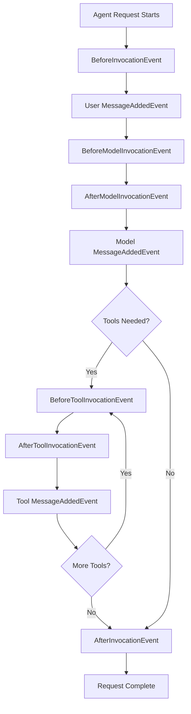

# Hooks

Hooks provide a powerful, type-safe extensibility system that allows you to subscribe to events throughout the agent lifecycle. This composable mechanism enables both built-in components and custom code to monitor, modify, or extend agent behavior at key execution points.

## Core Concepts

**Hook Event**: A specific moment in the agent lifecycle where callbacks can be triggered (e.g., before tool execution, after model response).

**Hook Callback**: A function that executes when its associated hook event occurs, receiving strongly-typed event data.

**Hook Provider**: A class that registers multiple callbacks across different events, enabling organized, reusable hook logic.

## Common Use Cases

- **Monitoring**: Track agent execution, tool usage, and performance metrics
- **Modification**: Alter tool parameters, swap tools, or transform results
- **Validation**: Add custom error handling and input validation
- **Logging**: Capture detailed execution traces for debugging and auditing
- **Security**: Implement access controls and sensitive data filtering

## Quick Start

### Simple Callback Registration

Register individual callbacks for specific events:

```python
from strands_agents import Agent
from strands_agents.hooks import BeforeInvocationEvent

def log_agent_start(event: BeforeInvocationEvent) -> None:
    print(f"Starting request for agent: {event.agent.name}")
    print(f"User message: {event.request.messages[-1].content}")

agent = Agent()
agent.hooks.add_callback(BeforeInvocationEvent, log_agent_start)
```

### Hook Provider Pattern

Create reusable hook collections with the `HookProvider` protocol:

```python
from strands_agents.hooks import HookProvider, HookRegistry

class RequestMonitor(HookProvider):
    def __init__(self):
        self.request_count = 0
        self.tool_usage = {}
    
    def register_hooks(self, registry: HookRegistry) -> None:
        registry.add_callback(BeforeInvocationEvent, self.track_request)
        registry.add_callback(BeforeToolInvocationEvent, self.track_tool_usage)
        registry.add_callback(AfterInvocationEvent, self.log_summary)
    
    def track_request(self, event: BeforeInvocationEvent) -> None:
        self.request_count += 1
        print(f"Processing request #{self.request_count}")
    
    def track_tool_usage(self, event: BeforeToolInvocationEvent) -> None:
        tool_name = event.tool_use.name
        self.tool_usage[tool_name] = self.tool_usage.get(tool_name, 0) + 1
    
    def log_summary(self, event: AfterInvocationEvent) -> None:
        print(f"Request completed. Total requests: {self.request_count}")
        print(f"Tool usage: {self.tool_usage}")

# Use the hook provider
monitor = RequestMonitor()
agent = Agent(hooks=[monitor])

# Or add after agent creation
agent.hooks.add_hook(monitor)
```

## Event Lifecycle

Understanding when events fire helps you choose the right hook points:



## Available Events

### Core Events
These events are stable and recommended for production use:

| Event | Timing | Use Cases |
|-------|--------|-----------|
| `AgentInitializedEvent` | After agent construction | Setup, configuration validation |
| `BeforeInvocationEvent` | Start of each request | Request logging, preprocessing |
| `AfterInvocationEvent` | End of each request | Cleanup, metrics, response processing |
| `MessageAddedEvent` | When messages are added | Conversation tracking, content filtering |

### Experimental Events
These events provide fine-grained control but may change in future releases:

| Event | Timing | Use Cases |
|-------|--------|-----------|
| `BeforeModelInvocationEvent` | Before LLM calls | Prompt modification, caching |
| `AfterModelInvocationEvent` | After LLM responses | Response filtering, cost tracking |
| `BeforeToolInvocationEvent` | Before tool execution | Tool swapping, parameter validation |
| `AfterToolInvocationEvent` | After tool execution | Result transformation, error handling |

## Advanced Patterns

### Tool Interception and Replacement

Replace or modify tools before execution:

```python
class SecurityHook(HookProvider):
    def __init__(self, allowed_tools: set[str]):
        self.allowed_tools = allowed_tools
        self.blocked_count = 0
    
    def register_hooks(self, registry: HookRegistry) -> None:
        registry.add_callback(BeforeToolInvocationEvent, self.validate_tool)
    
    def validate_tool(self, event: BeforeToolInvocationEvent) -> None:
        tool_name = event.tool_use.name
        
        if tool_name not in self.allowed_tools:
            # Replace with safe alternative
            event.selected_tool = self.get_safe_alternative()
            event.tool_use["name"] = "safe_info_tool"
            self.blocked_count += 1
            print(f"Blocked unauthorized tool: {tool_name}")
    
    def get_safe_alternative(self):
        # Return a safe tool that provides helpful error messages
        return SafeInfoTool()

# Usage
security = SecurityHook(allowed_tools={"calculator", "weather", "search"})
agent = Agent(hooks=[security])
```

### Result Transformation

Modify tool results after execution:

```python
class ResultEnhancer(HookProvider):
    def register_hooks(self, registry: HookRegistry) -> None:
        registry.add_callback(AfterToolInvocationEvent, self.enhance_results)
    
    def enhance_results(self, event: AfterToolInvocationEvent) -> None:
        tool_name = event.tool_use.name
        
        if tool_name == "calculator":
            self._format_calculation(event)
        elif tool_name == "weather":
            self._add_weather_context(event)
    
    def _format_calculation(self, event: AfterToolInvocationEvent) -> None:
        original = event.result["content"][0]["text"]
        # Add formatting and explanation
        event.result["content"][0]["text"] = f"🧮 Calculation Result: {original}"
    
    def _add_weather_context(self, event: AfterToolInvocationEvent) -> None:
        original = event.result["content"][0]["text"]
        # Add helpful context
        event.result["content"][0]["text"] = f"{original}\n\n💡 Tip: Weather can change quickly. Check again for the most current conditions."
```

### Comprehensive Monitoring

Create a full monitoring solution:

```python
import time
from datetime import datetime
from typing import Dict, List

class AgentMonitor(HookProvider):
    def __init__(self):
        self.metrics = {
            'requests': 0,
            'tools_used': {},
            'errors': 0,
            'total_time': 0.0
        }
        self.current_request_start = None
        self.conversation_log = []
    
    def register_hooks(self, registry: HookRegistry) -> None:
        registry.add_callback(BeforeInvocationEvent, self.start_request_timer)
        registry.add_callback(AfterInvocationEvent, self.end_request_timer)
        registry.add_callback(BeforeToolInvocationEvent, self.log_tool_usage)
        registry.add_callback(MessageAddedEvent, self.log_message)
    
    def start_request_timer(self, event: BeforeInvocationEvent) -> None:
        self.current_request_start = time.time()
        self.metrics['requests'] += 1
        print(f"📊 Request #{self.metrics['requests']} started at {datetime.now()}")
    
    def end_request_timer(self, event: AfterInvocationEvent) -> None:
        if self.current_request_start:
            duration = time.time() - self.current_request_start
            self.metrics['total_time'] += duration
            print(f"⏱️  Request completed in {duration:.2f}s")
            self.current_request_start = None
    
    def log_tool_usage(self, event: BeforeToolInvocationEvent) -> None:
        tool_name = event.tool_use.name
        self.metrics['tools_used'][tool_name] = self.metrics['tools_used'].get(tool_name, 0) + 1
        print(f"🔧 Using tool: {tool_name}")
    
    def log_message(self, event: MessageAddedEvent) -> None:
        self.conversation_log.append({
            'timestamp': datetime.now(),
            'role': event.message.role,
            'content_preview': str(event.message.content)[:100] + "..." if len(str(event.message.content)) > 100 else str(event.message.content)
        })
    
    def get_report(self) -> Dict:
        avg_time = self.metrics['total_time'] / max(self.metrics['requests'], 1)
        return {
            **self.metrics,
            'average_request_time': avg_time,
            'conversation_length': len(self.conversation_log)
        }

# Usage
monitor = AgentMonitor()
agent = Agent(hooks=[monitor])

# After some usage
print("📈 Agent Performance Report:")
report = monitor.get_report()
for key, value in report.items():
    print(f"  {key}: {value}")
```

## Best Practices

### Performance Guidelines

Keep hook callbacks lightweight and fast:

```python
# ✅ Good: Quick operations
def log_tool_use(event: BeforeToolInvocationEvent) -> None:
    logger.info(f"Tool used: {event.tool_use.name}")

# ❌ Avoid: Heavy operations that block execution
def slow_callback(event: BeforeToolInvocationEvent) -> None:
    # Don't do expensive operations like API calls
    response = requests.get("https://slow-api.com/log")  # Blocks agent execution
    
# ✅ Better: Queue heavy work for background processing
def queue_heavy_work(event: BeforeToolInvocationEvent) -> None:
    background_queue.put({
        'event_type': 'tool_use',
        'tool_name': event.tool_use.name,
        'timestamp': time.time()
    })
```

### Error Handling

Implement robust error handling in hooks:

```python
class SafeHook(HookProvider):
    def register_hooks(self, registry: HookRegistry) -> None:
        registry.add_callback(BeforeToolInvocationEvent, self.safe_callback)
    
    def safe_callback(self, event: BeforeToolInvocationEvent) -> None:
        try:
            # Your hook logic here
            self.process_tool_event(event)
        except Exception as e:
            # Log error but don't break agent execution
            logger.error(f"Hook error in {self.__class__.__name__}: {e}")
            # Optionally, implement fallback behavior
```

### Composable Design

Design hooks to work well together:

```python
# Each hook has a single responsibility
class RequestLogger(HookProvider):
    """Logs request start/end times"""
    pass

class ToolValidator(HookProvider):
    """Validates tool usage against policies"""
    pass

class ResultFormatter(HookProvider):
    """Formats tool results for better presentation"""
    pass

# Combine multiple hooks
agent = Agent(hooks=[
    RequestLogger(),
    ToolValidator(allowed_tools=["calculator", "search"]),
    ResultFormatter()
])
```

### Debugging Hook Behavior

Add debugging capabilities to your hooks:

```python
class DebuggableHook(HookProvider):
    def __init__(self, debug: bool = False):
        self.debug = debug
    
    def register_hooks(self, registry: HookRegistry) -> None:
        registry.add_callback(BeforeToolInvocationEvent, self.debug_tool_call)
    
    def debug_tool_call(self, event: BeforeToolInvocationEvent) -> None:
        if self.debug:
            print(f"🐛 Debug - Tool: {event.tool_use.name}")
            print(f"🐛 Debug - Parameters: {event.tool_use.input}")
            print(f"🐛 Debug - Selected tool type: {type(event.selected_tool)}")

# Enable debugging when needed
agent = Agent(hooks=[DebuggableHook(debug=True)])
```

## Callback Ordering

Understanding callback execution order is crucial for complex hook interactions:

- **Before events**: Execute in registration order
- **After events**: Execute in reverse registration order (LIFO)
- This ensures proper setup/teardown semantics

```python
class FirstHook(HookProvider):
    def register_hooks(self, registry: HookRegistry) -> None:
        registry.add_callback(BeforeInvocationEvent, lambda e: print("First: Before"))
        registry.add_callback(AfterInvocationEvent, lambda e: print("First: After"))

class SecondHook(HookProvider):
    def register_hooks(self, registry: HookRegistry) -> None:
        registry.add_callback(BeforeInvocationEvent, lambda e: print("Second: Before"))
        registry.add_callback(AfterInvocationEvent, lambda e: print("Second: After"))

agent = Agent(hooks=[FirstHook(), SecondHook()])

# Output will be:
# First: Before
# Second: Before
# ... (agent execution) ...
# Second: After  # Reverse order for cleanup
# First: After
```

This ordering ensures that the last hook to set up is the first to clean up, maintaining proper resource management and state consistency.
