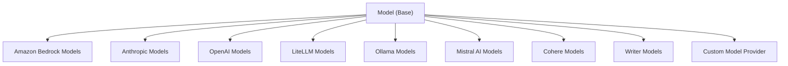

# Models in Strands Agents SDK

The Strands Agents SDK provides a flexible and extensible model architecture that allows you to work with a wide range of language models from different providers. This document explains how models work in Strands, the supported model providers, and how to create custom model integrations.

## Model Architecture

Strands uses an abstract `Model` class that defines the standard interface all model providers must implement:



This architecture allows Strands to work with various model providers through a unified interface while handling the specific requirements of each provider behind the scenes.

## Supported Model Providers

Strands supports several major model providers out of the box:

### Amazon Bedrock

```python
from strands import Agent
from strands.models.bedrock import BedrockModel

# Claude 3 Sonnet
agent = Agent(model=BedrockModel(
    model_id="anthropic.claude-3-sonnet-20240229-v1:0",
    params={"max_tokens": 4000}
))

# Claude 3 Haiku
agent = Agent(model=BedrockModel(
    model_id="anthropic.claude-3-haiku-20240307-v1:0",
    params={"max_tokens": 4000}
))

# Claude 3 Opus
agent = Agent(model=BedrockModel(
    model_id="anthropic.claude-3-opus-20240229-v1:0",
    params={"max_tokens": 4000}
))
```

### Anthropic

```python
from strands import Agent
from strands.models.anthropic import AnthropicModel

agent = Agent(model=AnthropicModel(
    api_key="your-api-key",
    model_id="claude-3-sonnet-20240229", # default
    params={"max_tokens": 4000}
))
```

### OpenAI

```python
from strands import Agent
from strands.models.openai import OpenAIModel

agent = Agent(model=OpenAIModel(
    api_key="your-api-key",
    model_id="gpt-4-turbo", # default
    params={"max_tokens": 4000}
))
```

### Mistral AI

```python
from strands import Agent
from strands.models.mistral import MistralModel

agent = Agent(model=MistralModel(
    api_key="your-api-key",
    model_id="mistral-large-latest", # default
    params={"max_tokens": 4000}
))
```

### Cohere

```python
from strands import Agent
from strands.models.cohere import CohereModel

agent = Agent(model=CohereModel(
    api_key="your-api-key",
    model_id="command-r-plus", # default
    params={"max_tokens": 4000}
))
```

### Writer

```python
from strands import Agent
from strands.models.writer import WriterModel

agent = Agent(model=WriterModel(
    api_key="your-api-key",
    model_id="palmyra-instruct-30b", # default
    params={"max_tokens": 4000}
))
```

### LiteLLM

```python
from strands import Agent
from strands.models.litellm import LiteLLMModel

agent = Agent(model=LiteLLMModel(
    api_key="your-api-key",
    model_id="gpt-4-turbo", # default
    params={"max_tokens": 4000}
))
```

### Ollama

```python
from strands import Agent
from strands.models.ollama import OllamaModel

agent = Agent(model=OllamaModel(
    model_id="llama3",
    params={"max_tokens": 4000}
))
```

## Default Model Selection

If you don't specify a model when creating an agent, Strands will attempt to use a default model based on available environment variables:

```python
# Uses default model based on environment variables
agent = Agent()
```

The model selection process follows this order:
1. Check for specific provider environment variables (e.g., `ANTHROPIC_API_KEY`)
2. Use a default provider (currently Anthropic Claude 3 Sonnet)
3. Raise an exception if no model can be configured

## Model Configuration

Each model provider supports different configuration options. Common parameters include:

- **model_id**: The specific model version to use
- **api_key**: Authentication key for the model provider
- **params**: Model-specific parameters like `max_tokens`, `temperature`, etc.

You can update model configuration at runtime:

```python
# Update model configuration
agent.model.update_config(temperature=0.7, max_tokens=2000)

# Get current configuration
config = agent.model.get_config()
print(config)
```

## Creating a Custom Model Provider

You can extend Strands with custom model providers by implementing the `Model` abstract class:

```python
from typing import Any, AsyncIterable, Optional
from strands.models import Model
from strands.types.content import Messages
from strands.types.streaming import StreamEvent
from strands.types.tools import ToolSpec

class CustomModel(Model):
    """Custom model provider implementation."""

    def __init__(self, api_key: str, model_id: str, **params):
        self.api_key = api_key
        self.model_id = model_id
        self.params = params
        self.client = YourModelClient(api_key)

    async def stream(
        self,
        messages: Messages,
        tool_specs: Optional[list[ToolSpec]] = None,
        system_prompt: Optional[str] = None,
        **kwargs: Any
    ) -> AsyncIterable[StreamEvent]:
        """Stream responses from your custom model.

        Args:
            messages: List of conversation messages
            tool_specs: Optional list of available tools
            system_prompt: Optional system prompt

        Returns:
            AsyncIterable of StreamEvent objects
        """
        # 1. Format the request for your model API
        request = self._format_request(messages, tool_specs, system_prompt)
        
        # 2. Call your model API
        response = await self.client.generate_stream(request)
        
        # 3. Yield message start event
        yield {"messageStart": {"role": "assistant"}}
        
        # 4. Process and yield streaming chunks
        async for chunk in response:
            if chunk.get("type") == "text":
                yield {
                    "contentBlockDelta": {
                        "delta": {"text": chunk.get("content", "")}
                    }
                }
        
        # 5. Yield message stop event
        yield {"messageStop": {"stopReason": "end_turn"}}
```

Key requirements for custom model implementation:

1. **Stream Interface**: Implement the `stream` method to handle request formatting, model invocation, and response processing
2. **Message Formatting**: Convert Strands' message format to your model API's expected format
3. **StreamEvent Protocol**: Format responses according to Strands' `StreamEvent` protocol
4. **Tool Support**: Handle tool specifications appropriately if your model supports tools
5. **Error Handling**: Implement robust error handling for API communication

## Best Practices

1. **Model Selection**: Choose the appropriate model for your task requirements and budget constraints

2. **Parameter Tuning**: Adjust model parameters like temperature, max_tokens, and top_p based on your specific use case

3. **Error Handling**: Implement proper error handling for model API failures, including retries with exponential backoff

4. **Context Management**: Be aware of each model's context window limitations and manage conversation history accordingly

5. **Cost Monitoring**: Track token usage and costs, especially for production applications

6. **Tool Support**: Verify that your chosen model properly supports tools if your agent requires tool usage

7. **Security**: Store API keys securely using environment variables or a secrets manager

8. **Performance Optimization**: Consider model latency requirements for your application and choose models accordingly

9. **Configuration Updates**: Use the update_config method to adjust model behavior without recreating agents

10. **Custom Implementations**: For specialized needs, implement a custom model provider that follows the Model interface