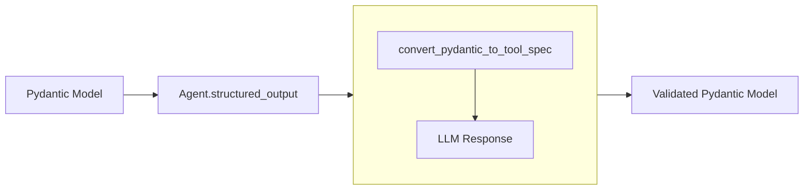

# Structured Output in Strands

Structured output in the Strands Agents SDK provides a powerful mechanism for obtaining type-safe, validated responses from language models using Pydantic models. This transforms unstructured LLM text responses into reliable, program-friendly data structures that integrate seamlessly with your application's type system.

## Overview

Structured output allows you to constrain language model responses to follow a specific schema defined by a Pydantic model. Rather than receiving raw text that needs parsing and validation, you receive a properly structured Python object with the correct types and validations already applied.

### Key Benefits

- **Type Safety**: Get typed Python objects instead of raw strings
- **Automatic Validation**: Pydantic validates responses against your schema
- **Clear Documentation**: Schema serves as documentation of expected output
- **IDE Support**: Enjoy autocomplete and type checking for LLM-generated responses
- **Error Prevention**: Catch malformed responses early in the process

## How It Works



The structured output system converts your Pydantic models into tool specifications that guide the language model to produce correctly formatted responses. The conversion and validation process happens behind the scenes through the `Agent.structured_output()` method.

## Basic Usage

Define your desired output structure using Pydantic models and use the `Agent.structured_output()` method:

```python
from pydantic import BaseModel
from strands import Agent

class PersonInfo(BaseModel):
    name: str
    age: int
    occupation: str

agent = Agent()
result = agent.structured_output(
    PersonInfo,
    "John Smith is a 30-year-old software engineer"
)

print(f"Name: {result.name}")      # "John Smith"
print(f"Age: {result.age}")        # 30
print(f"Job: {result.occupation}") # "software engineer"
```

## Advanced Usage

### Complex Nested Models

Handle sophisticated data structures with nested Pydantic models:

```python
from typing import List, Optional
from pydantic import BaseModel, Field

class Address(BaseModel):
    street: str
    city: str
    country: str
    postal_code: Optional[str] = None

class Contact(BaseModel):
    email: Optional[str] = None
    phone: Optional[str] = None

class Person(BaseModel):
    """Complete person information."""
    name: str = Field(description="Full name of the person")
    age: int = Field(description="Age in years")
    address: Address = Field(description="Home address")
    contacts: List[Contact] = Field(default_factory=list, description="Contact methods")
    skills: List[str] = Field(default_factory=list, description="Professional skills")

result = agent.structured_output(
    Person,
    "Extract info: Jane Doe, a systems admin, 28, lives at 123 Main St, New York, NY. Email: jane@example.com"
)

print(result.name)                    # "Jane Doe"
print(result.address.city)            # "New York"
print(result.contacts[0].email)       # "jane@example.com"
print(result.skills)                  # ["systems admin"]
```

### Using with Conversation Context

Structured output can leverage existing conversation context:

```python
agent = Agent()

# Build up conversation context
agent("What do you know about Paris, France?")
agent("Tell me about the weather there in spring.")

# Extract structured information with a prompt
class CityInfo(BaseModel):
    city: str
    country: str
    population: Optional[int] = None
    climate: str

# Uses existing conversation context with a prompt
result = agent.structured_output(CityInfo, "Extract structured information about Paris")
```

### Multi-Modal Input

Extract structured information from prompts containing images, documents, and other content types:

```python
class PersonInfo(BaseModel):
    name: str
    age: int
    occupation: str

with open("path/to/document.pdf", "rb") as fp:
    document_bytes = fp.read()

result = agent.structured_output(
    PersonInfo,
    [
        {"text": "Please process this application."},
        {
            "document": {
                "format": "pdf",
                "name": "application",
                "source": {
                    "bytes": document_bytes,
                },
            },
        },
    ]
)
```

### Asynchronous Structured Output

Strands also supports obtaining structured output asynchronously:

```python
import asyncio
from pydantic import BaseModel
from strands import Agent

class PersonInfo(BaseModel):
    name: str
    age: int
    occupation: str

async def structured_output():
    agent = Agent()
    return await agent.structured_output_async(
        PersonInfo,
        "John Smith is a 30-year-old software engineer"
    )

result = asyncio.run(structured_output())
```

### Error Handling

Implement proper error handling for validation failures:

```python
from pydantic import ValidationError

try:
    result = agent.structured_output(MyModel, prompt)
except ValidationError as e:
    print(f"Validation failed: {e}")
    # Handle appropriately:
    # 1. Retry with a more specific prompt
    # 2. Fall back to a simpler model
    # 3. Extract partial information from the error
```
